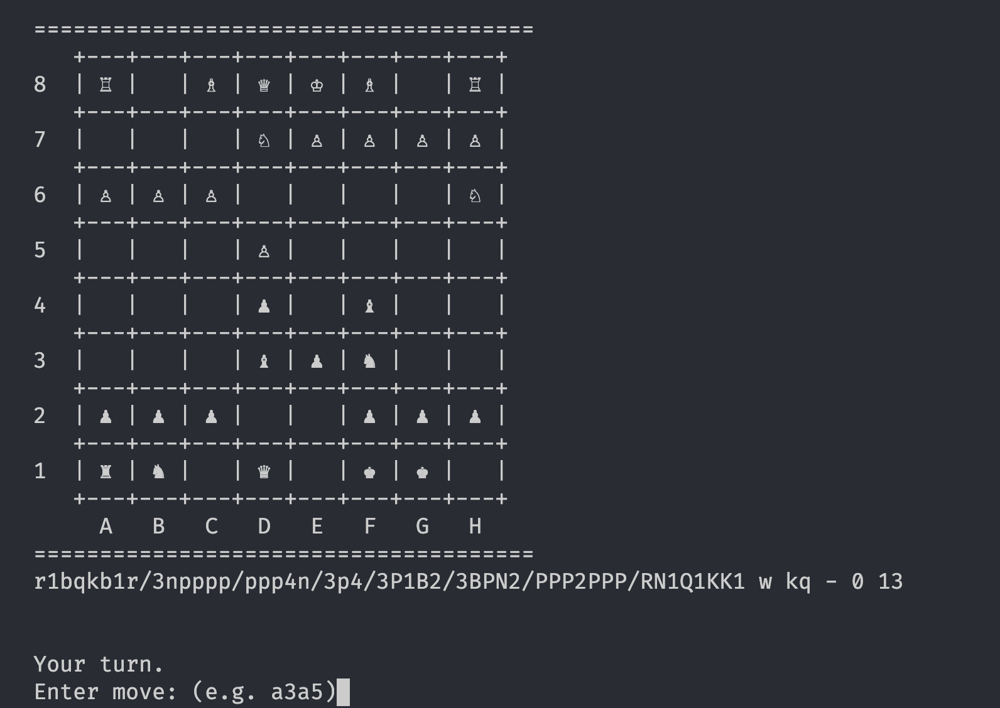

# Chess

This project is for the "DX and Clean Code: Enhancing Developer Experience through Quality Code TX00FK85-3001" course.

It's a simple chess game that currently works in the Command Line Interface (CLI). The computer opponent picks a random legal move on its turn. The idea is to make the game online and add a simple web based GUI.

## Getting Started

These instructions will help you get a copy of the project up and running on your local machine.

### Prerequisites

Node.js (v18+):
[Download here](https://nodejs.org/en).

Package Manager:
[pnpm](https://pnpm.io/) (Recommended). Install via npm install -g pnpm. npm also works fine.

## Installation

1. Clone the repository
2. In the terminal, navigate to the project root
3. Install dependencies: `pnpm install` or `npm install`

## Running the game

In the project directory, run: `pnpm start` or `npm start`

# Linting

Code style is enforced with eslint and prettier

The project can be linted with `pnpm lint` or `npm run lint`

## Roadmap

-   [x] chess
-   [ ] websocket server for online multiplayer
-   [ ] web GUI

## Terminology

-   "FEN" ([Forsyth-Edwards Notation](https://www.chessprogramming.org/Forsyth-Edwards_Notation)) is used in the code to serialize/deserialize chess games.
